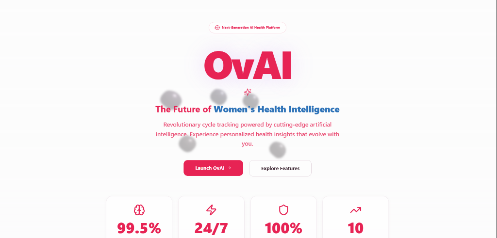

# OvAI - Women's Health & Wellness Platform

<div align="center">



**Your Complete Women's Health Companion**

[](https://opensource.org/licenses/MIT)
[](https://reactjs.org/)
[](https://www.typescriptlang.org/)
[](https://vitejs.dev/)
[](https://supabase.com/)

[Live Demo](sooon) • [Report Bug](https://github.com/Mohammedsanin/ovai/issues) • [Request Feature](https://github.com/yourusername/ovai/issues)

</div>

---

## 📋 Table of Contents

- [About](#-about)
- [Features](#-features)
- [Tech Stack](#-tech-stack)
- [Getting Started](#-getting-started)
  - [Prerequisites](#prerequisites)
  - [Installation](#installation)
  - [Environment Setup](#environment-setup)
- [Usage](#-usage)
- [Project Structure](#-project-structure)
- [API Integration](#-api-integration)
- [Deployment](#-deployment)
- [Contributing](#-contributing)
- [License](#-license)
- [Contact](#-contact)

---

## 🌟 About

**OvAI** is a comprehensive, AI-powered women's health and wellness platform designed to help women track, monitor, and improve their overall well-being. From menstrual cycle tracking to nutrition planning, fitness monitoring, pregnancy support, and mental health resources, OvAI provides a holistic approach to women's health management.

### Why OvAI?

- **All-in-One Solution**: Consolidates multiple health tracking needs into a single, intuitive platform
- **AI-Powered Insights**: Leverages artificial intelligence to provide personalized health recommendations
- **Privacy-Focused**: Your health data is secure and private
- **Community Support**: Connect with other women on similar health journeys
- **Evidence-Based**: Built on scientific research and medical best practices

---

## ✨ Features

### 🩸 **Menstrual Cycle Tracking**
- Track periods, symptoms, and mood changes
- Predict upcoming cycles with AI-powered algorithms
- Monitor fertility windows and ovulation
- Personalized insights and health tips

### 🥗 **Nutrition Management**
- Calorie and macro tracking
- Personalized meal planning
- Recipe suggestions based on dietary preferences
- Nutritional insights and recommendations

### 💪 **Fitness Tracking**
- Workout logging and planning
- Exercise recommendations
- Progress tracking with visual analytics
- Integration with fitness goals

### 🤰 **Pregnancy Support**
- Week-by-week pregnancy tracking
- Fetal development information
- Contraction timer
- Prenatal care reminders and tips

### 🏥 **Healthcare Management**
- Medical appointment tracking
- Medication reminders
- Health records storage
- Doctor finder with Google Maps integration

### 🧘 **Mental Wellness**
- Mood tracking and journaling
- Meditation and mindfulness resources
- Stress management tools
- Mental health check-ins

### 👥 **Community Features**
- Discussion forums
- Support groups
- Expert Q&A
- Share experiences and tips

### 💬 **AI Chatbot**
- 24/7 health assistance
- Personalized health advice
- Symptom checker
- Quick answers to health questions

---

## 🛠️ Tech Stack

### **Frontend**
- **Framework**: React 18.3.1 with TypeScript
- **Build Tool**: Vite 5.4.19
- **Styling**: Tailwind CSS 3.4.17
- **UI Components**: shadcn/ui with Radix UI primitives
- **Animations**: Framer Motion 12.23.24
- **Routing**: React Router DOM 6.30.1
- **State Management**: TanStack Query (React Query) 5.83.0
- **Forms**: React Hook Form 7.61.1 with Zod validation
- **Charts**: Recharts 2.15.4
- **3D Graphics**: Three.js with React Three Fiber

### **Backend & Services**
- **Database**: Supabase (PostgreSQL)
- **Authentication**: Supabase Auth
- **Storage**: Supabase Storage
- **Edge Functions**: Supabase Functions

### **AI & APIs**
- **AI Integration**: Google Gemini API
- **Voice AI**: ElevenLabs React SDK
- **Maps**: Google Maps & Places API
- **Media**: YouTube API

### **Development Tools**
- **Linting**: ESLint 9.32.0
- **Type Checking**: TypeScript 5.8.3
- **Package Manager**: npm / bun

---

## 🚀 Getting Started

### Prerequisites

Before you begin, ensure you have the following installed:
- **Node.js** (v18 or higher) - [Download](https://nodejs.org/)
- **npm** or **bun** - Comes with Node.js
- **Git** - [Download](https://git-scm.com/)

### Installation

1. **Clone the repository**
   ```bash
   git clone https://github.com/Mohammedsanin/ovai.git
   cd ovai
   ```

2. **Install dependencies**
   ```bash
   npm install
   # or
   bun install
   ```

### Environment Setup

1. **Create a `.env` file** in the root directory:
   ```bash
   cp .env.example .env
   ```

2. **Configure environment variables**:
   ```env
   # Supabase Configuration
   VITE_SUPABASE_PROJECT_ID=your_project_id
   VITE_SUPABASE_URL=your_supabase_url
   VITE_SUPABASE_PUBLISHABLE_KEY=your_supabase_anon_key

   # Google APIs
   GEMINI_API_KEY=your_gemini_api_key
   VITE_GOOGLE_PLACES_API_KEY=your_places_api_key
   VITE_GOOGLE_MAPS_API_KEY=your_maps_api_key
   VITE_YOUTUBE_API_KEY=your_youtube_api_key
   ```

3. **Set up Supabase**:
   - Create a new project at [Supabase](https://supabase.com/)
   - Run the migrations from the `supabase/migrations` folder
   - Deploy the edge functions from `supabase/functions`

4. **Obtain API Keys**:
   - **Gemini API**: [Google AI Studio](https://makersuite.google.com/app/apikey)
   - **Google Maps/Places**: [Google Cloud Console](https://console.cloud.google.com/)
   - **YouTube API**: [Google Developers Console](https://console.developers.google.com/)

---

## 💻 Usage

### Development Server

Start the development server with hot-reload:

```bash
npm run dev
```

The application will be available at `http://localhost:5173`

### Build for Production

Create an optimized production build:

```bash
npm run build
```

### Preview Production Build

Preview the production build locally:

```bash
npm run preview
```

### Linting

Run ESLint to check code quality:

```bash
npm run lint
```

---

## 📁 Project Structure

```
ovai/
├── src/
│   ├── components/        # Reusable UI components
│   │   ├── Auth/         # Authentication components
│   │   ├── ui/           # shadcn/ui components
│   │   └── ...           # Feature-specific components
│   ├── pages/            # Application pages/routes
│   │   ├── Dashboard.tsx
│   │   ├── Periods.tsx
│   │   ├── Nutrition.tsx
│   │   ├── Fitness.tsx
│   │   ├── Pregnancy.tsx
│   │   ├── Healthcare.tsx
│   │   ├── Community.tsx
│   │   ├── Chatbot.tsx
│   │   └── ...
│   ├── hooks/            # Custom React hooks
│   ├── integrations/     # API integrations (Supabase, etc.)
│   ├── lib/              # Utility libraries
│   ├── utils/            # Helper functions
│   ├── ai/               # AI integration logic
│   ├── assets/           # Static assets (images, icons)
│   ├── App.tsx           # Main application component
│   ├── main.tsx          # Application entry point
│   └── index.css         # Global styles
├── supabase/
│   ├── functions/        # Supabase Edge Functions
│   ├── migrations/       # Database migrations
│   └── config.toml       # Supabase configuration
├── public/               # Public static files
├── .env                  # Environment variables (not in git)
├── package.json          # Project dependencies
├── tsconfig.json         # TypeScript configuration
├── tailwind.config.ts    # Tailwind CSS configuration
├── vite.config.ts        # Vite configuration
└── README.md             # This file
```

---

## 🔌 API Integration

### Supabase

OvAI uses Supabase for:
- **Authentication**: User sign-up, login, and session management
- **Database**: PostgreSQL for storing user data, health records, and community posts
- **Storage**: File storage for profile pictures and health documents
- **Real-time**: Live updates for community features

### Google Gemini AI

The AI chatbot and personalized recommendations are powered by Google's Gemini API, providing:
- Natural language understanding
- Health-related Q&A
- Personalized insights based on user data

### Google Maps & Places

Healthcare provider search and location services use:
- **Maps API**: Display clinic and hospital locations
- **Places API**: Search for nearby healthcare facilities

---


## 🤝 Contributing

We welcome contributions to OvAI! Here's how you can help:

### How to Contribute

1. **Fork the repository**
2. **Create a feature branch**
   ```bash
   git checkout -b feature/AmazingFeature
   ```
3. **Commit your changes**
   ```bash
   git commit -m 'Add some AmazingFeature'
   ```
4. **Push to the branch**
   ```bash
   git push origin feature/AmazingFeature
   ```
5. **Open a Pull Request**

### Development Guidelines

- Follow the existing code style and conventions
- Write meaningful commit messages
- Add tests for new features
- Update documentation as needed
- Ensure all tests pass before submitting PR

### Code of Conduct

Please note that this project is released with a Contributor Code of Conduct. By participating in this project you agree to abide by its terms.

---

## 📄 License

This project is licensed under the **MIT License** - see the [LICENSE](LICENSE) file for details.

---

## 📧 Contact

**Project Maintainer**: Mohammed Sanin

- **Email**: saninmohammed03@gmail.com
- **GitHub**: [@yourusername](https://github.com/Mohammedsanin)
- **Linkedin**: [@yourhandle](www.linkedin.com/in/mohammed-sanin)

**Project Link**: [https://github.com/Mohammedsanin/ovai](https://github.com/Mohammedsanin/ovai)

**Live Demo**: soon

---

## 🙏 Acknowledgments

- [shadcn/ui](https://ui.shadcn.com/) for the beautiful UI components
- [Supabase](https://supabase.com/) for the backend infrastructure
- [Google Gemini](https://deepmind.google/technologies/gemini/) for AI capabilities
- All contributors who have helped shape OvAI

---

<div align="center">

**Made with ❤️ for women's health and wellness**

⭐ Star this repo if you find it helpful!

</div>
